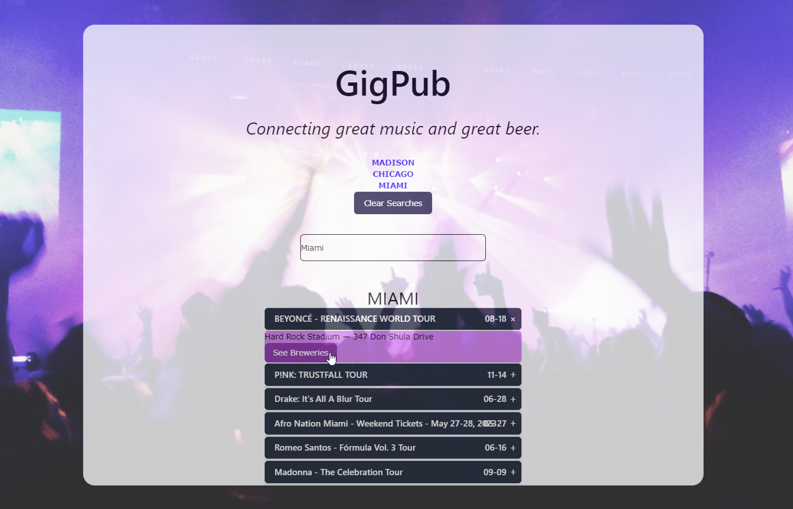
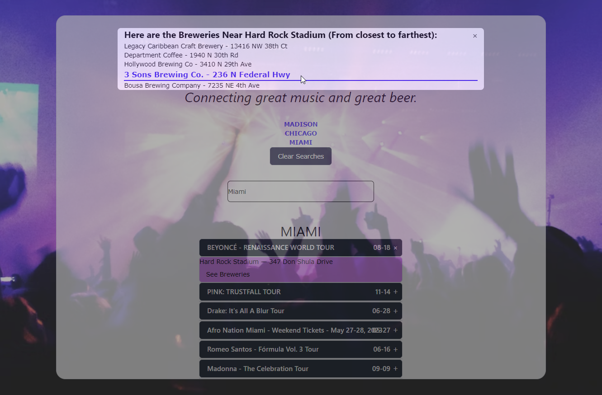

# GigPub

A page where users can search by city to find music events and breweries nearby. 

## User Story

AS a person trying to plan their night out  
I WANT to find out what live music events and breweries are in my area  
SO THAT I know where the beers that are local to the venue came from, and I can go check them out too

## Acceptance Critera

GIVEN I am a person visiting a city  
WHEN I visit the website  
THEN I'm given the option to search for live music nearby  
WHEN I enter my search criteria  
THEN I'm given a list of live music options, as well as breweries in the area

## Visuals

## Technologies Used

- HTML
- Tailwind CSS
- JavaScript
- W3.CSS

## Description

This webpage gives the user a place to go to for searching music events as well as breweries nearby. The user can simply enter the city of choice in the search and a list of music events will populate. The user can click on their event of choice and a drop down will give the user the option to click if they'd like the breweries displayed. Each city searched will create a button with the city name so the user can go back to view previous searches. 

## Installation

1. Get a free API Key from the following sites:
- https://www.openbrewerydb.org/
- https://developer.ticketmaster.com/products-and-docs/apis/discovery-api/v2/
2. Create an index.html, style.css, script.js file.
3. Create a variable for each API Key in your script.js file. 

## Deployed Page Link

https://mewesley1984.github.io/GitPub/

## Authors 
- Chris Messa 
- Matt Wesley
- Mason Bauer
- Adorah Tho

## Acknowledgements
- https://fonts.google.com/ 
- https://tailwindcss.com/ 
- https://www.w3schools.com/w3css/default.asp 
