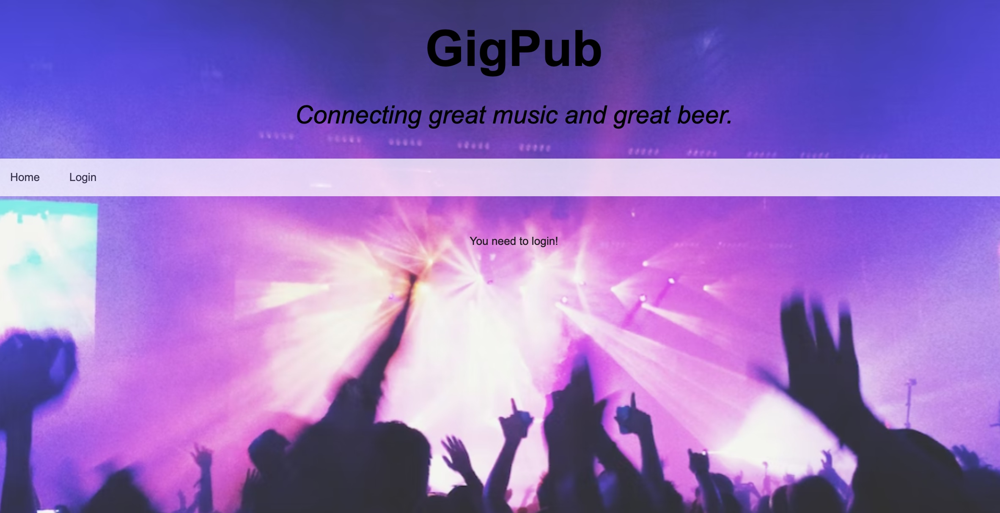
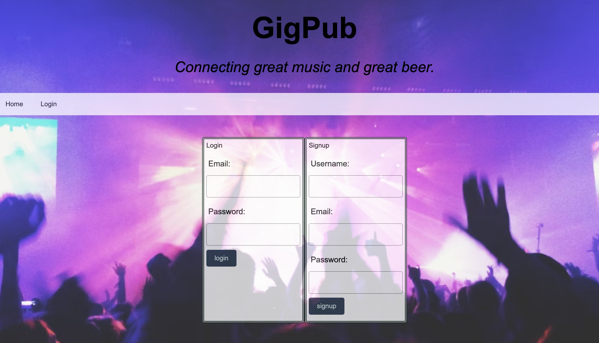
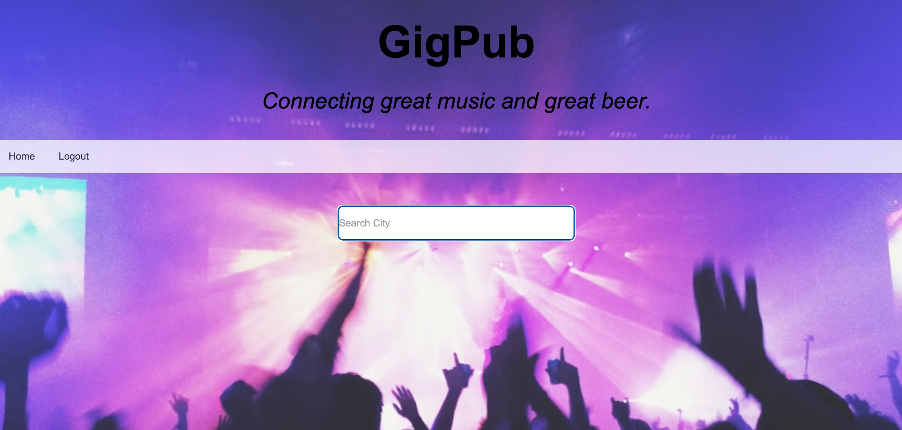

# GigPub-2.0

## Description
GigPub makes it easier for concert lovers to find cool breweries nearby the venue they are attending.  Instead of searching multiple websites, GigPub is a one stop shop for great music and great beer.

## Table of Contents
- [User Story](#user-story)
- [Acceptance Criteria](#acceptance-criteria)
- [Installation](#installation)
- [Usage](#usage)
- [Credits](#credits)

## User Story

```
AS A live music enthusiast
I WANT to be able to search a city for music and events and breweries nearby the music venues
SO THAT I can plan my night out accordingly
```

## Acceptance Criteria

```
WHEN a user goes to the homepage
THEN they are prompted to login or create an account
WHEN the user logs in 
THEN they are able to search by city
WHEN they search a city
THEN they are shown upcoming events, venue reviews
WHEN they click on the event
THEN they are shown breweries nearby
```

## Installation
- Brought in original GigPub-1.0 version
- Connected to local server using server.js
- Built database to store user input and user reviews. Seeded database
- Built routing for users, login, reviews and connected to models
- Utilized Handlebars to connect front-end with back-end
- Referenced tickemaster API to filter out venueId to add/modify/delete/get reviews

## Mock Up







## Credits


